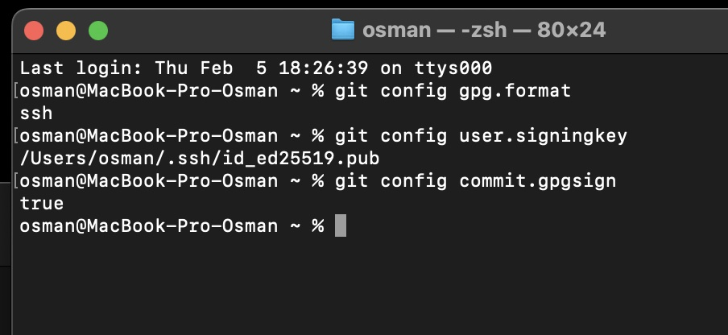
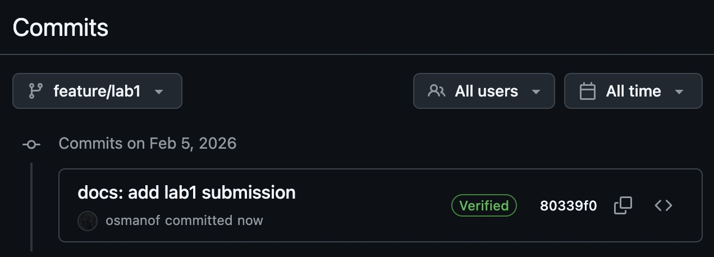
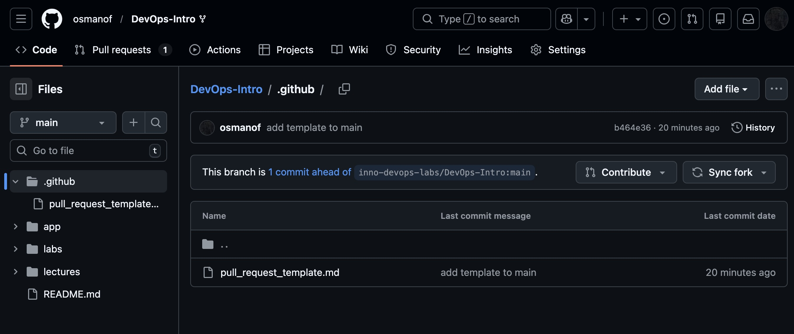
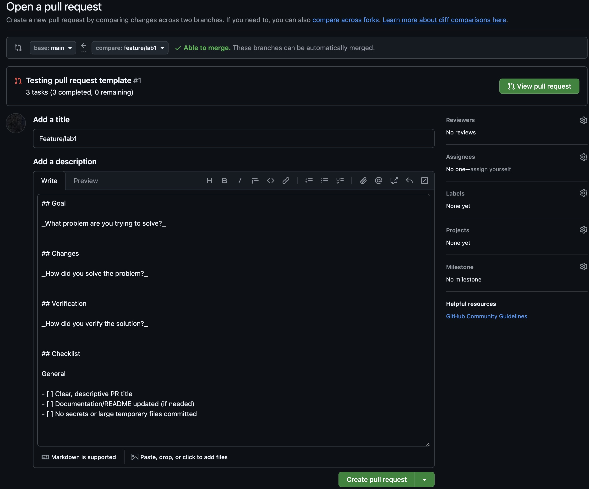

## Task 1

Подписание коммитов позволяет помечать автору коммита, что он реальный автор. После подписания ключа в github появится плашка "Verified", что даст окрущающим знать, что коммит делал действительно я. 

Подтверждение ssh:

Подтверждение "Verified":

Ответ на вопрос: использование ssh подписей в devops позволяет всем разработчикам, которые работают над проектом, понимать, что все комиты сделаны их коллегами. Никто другой без ssh кода не может сделать коммиты за разработчика, поэтому это защита от внедрения неправильного кода.

## Task 2

Скриншот того, что файл есть:

Скриншот того, что pr template загрузился:

### Как помогает pr template
Когда создается запрос pull request в после description появляется заготовка с файлом pr template. Если нет заготовки, то description пустой. Заготовка позволяет стандартизировать формат описания для всех разработчиков (как я понял), чтобы никто ничего не забыл и четко говорил, что да как он делал и зачем.

### Сложности
Ну это сложно разобраться во всех командах. Я удалил комит свой случайно и после этого не смог восстановить после стольких часов работы и уже хотел забить на дз, но в итоге у меня получилось все вернуть. Проблема еще была, что я не понимал, где должен находиться pr template (хотя это было написано), хотя deepseek мне сказал, что должен находиться в ветке lab1, потом на stackoverflow увидел, что сказали, что должен быть в main, потом я такую же информацию увидел в файле с дз. Ну после того как перекинул в main все заработало. В целом прикольно, но нервозатратно.
